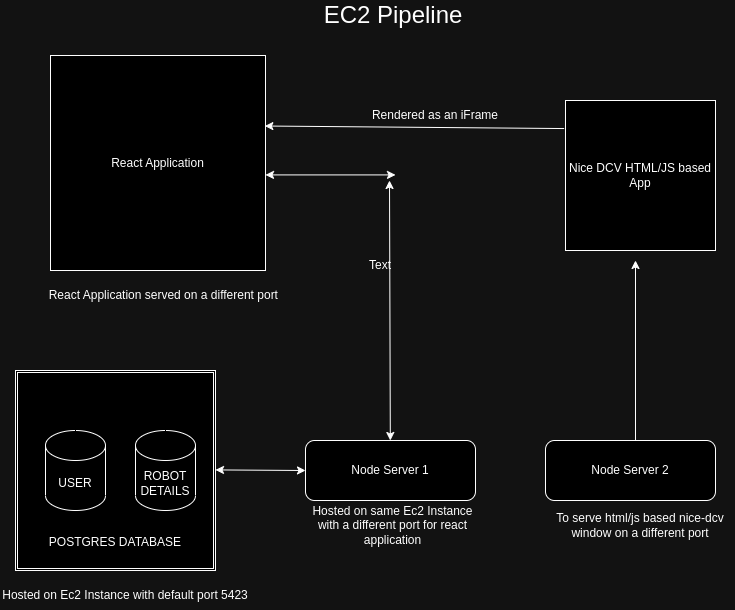

### Inception Robotics Project with NiceDCV Integration

#### Build and Run

1. Must have a PostgresSQL database setup on the computer:

- Once setup, change create a .env in /backend folder in the following format:

  ```
  DB_USER=*** (mostly will be postgres)
  PASSWORD=******
  HOST="localhost"
  PORT=**** (Default is 5432)
  DATABASE= Database Name
  JWT_SECRET= Can set any secret
  ```

- Create the tables as mentioned in /backend/database.sql

2. Open /nice_dcv folder with a new window of visual studio code. Install live server extension and serve the website on it. Will need to set up an https server.

3. Run the following:

   ```
   # For Backend
   cd <folder>/backend
   nodemon index

   # For Frontend
   cd <folder>/frontend
   npm run build
   npm start

   ```

#### Architecture of the App


